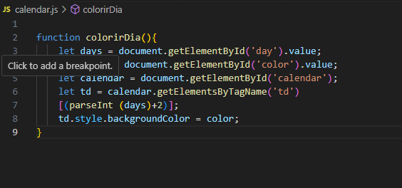

# Sistema de Agendamento de Fretes - Alpha Transportes
### Descrição:

    O Sistema de Agendamento de Fretes da Alpha Transportes é uma ferramenta web que facilita a organização e o controle dos fretes contratados pela empresa. O sistema permite registrar os agendamentos de acordo com a disponibilidade dos veículos, garantindo que cada frete seja realizado de forma eficiente e segura.

## Funcionalidades:

### Gerenciamento de veículos:

    Cadastro de veículos com suas respectivas cores e capacidades.
    Visualização da lista de veículos disponíveis.
    Controle de limite de fretes por veículo (3 por mês).

### Relatórios:
    Emissão de relatórios com a lista de fretes agendados.
    Filtros por data, veículo e status do frete.
    Visualização da quantidade de fretes realizados por veículo.
## Tecnologias utilizadas:

    HTML
    CSS
    JavaScript
    Banco de dados (opcional)
### Requisitos:

    Navegador web moderno
    Acesso à internet
### Como usar:

    Acesse o sistema através do link fornecido pela empresa.
    Faça login com seu usuário e senha.
    Na tela inicial, clique em "Novo Agendamento".
    Preencha os campos com as informações do frete: data, hora, local, veículo etc.
    Clique em "Salvar" para registrar o agendamento.
    Para visualizar os agendamentos, acesse o menu "Fretes Agendados".
    Utilize os filtros para encontrar os fretes desejados.
    Gere relatórios para acompanhar o desempenho da frota.

## Benefícios:

    Otimização do tempo na organização dos fretes.
    Redução de erros e falhas na comunicação.
    Maior controle sobre a disponibilidade dos veículos.
    Agilidade na identificação de possíveis problemas.
    Melhoria na qualidade do serviço prestado aos clientes.

## Observações:

    Este projeto é um exemplo didático e pode ser aprimorado de diversas maneiras.
    A implementação de um banco de dados é opcional, mas pode ser útil para armazenar e gerenciar as informações dos fretes e veículos.
## Links úteis:

    Repositório do projeto: (Link do repositório do projeto)
    Esperamos que este sistema seja uma ferramenta útil para a equipe da Alpha Transportes!

## Recursos adicionais:

    Integração com GPS: Permita que os motoristas visualizem a rota do frete em tempo real.
    Notificações: Envie notificações por e-mail ou SMS para os motoristas e clientes sobre os agendamentos.
    Painel de controle: Crie um painel com gráficos e indicadores para acompanhar o desempenho da frota.
    Com um pouco de criatividade e personalização, o Sistema de Agendamento de Fretes da Alpha Transportes se torna uma ferramenta poderosa para otimizar a logística da empresa e garantir a satisfação dos clientes.

## imagens

# projeto finalizado

## Java

## HTML
